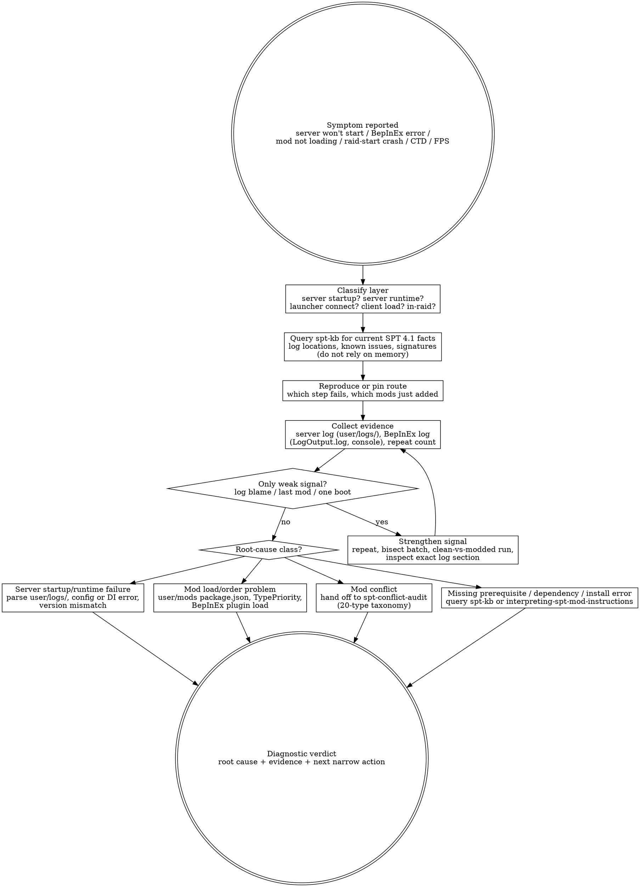

# Diagnosing SPT Problems (judgment skill)

Crashes and failures are not solved by ritual. A diagnostic pass starts with the
symptom the user can reproduce, turns it into evidence, and only then chooses
the tool or fix. A log line naming a mod, last-installed-mod panic, and generic
optimization lists are inputs to investigate, not verdicts to obey.

SPT is a client/server pair: the C# server (`SPT_Runtime\SPT.Server.exe`), the
launcher (`SPT.Launcher.exe`), and the BepInEx-patched client. Each layer has
its own log surface, and each failure class has a distinct evidence trail.

## The Iron Law

```text
+----------------------------------------------------------------------------------------------+
| Diagnose the symptom before prescribing the cure: reproduce it, collect evidence, isolate the |
| trigger, then assign root cause. A log line's mod name is a clue, never the diagnosis.         |
+----------------------------------------------------------------------------------------------+
```

## Route gate (one primary skill per intent)

Use this skill when the primary question is: **"It broke — what is the diagnostic ladder?"**

Do **not** use this skill as the primary skill for adjacent intents:

| User intent | Primary skill |
|---|---|
| "I installed a batch; how do I proactively verify it before playing?" | `testing-spt-modpack` |
| "Which mods conflict / why is this mod not working / route or table overwrite?" | `spt-conflict-audit` |
| "Should this mod be in the pack at all?" | `evaluating-spt-mods` |
| "How do I install X per the author?" | `interpreting-spt-mod-instructions` |

Terminal handoff: once the ladder identifies the root-cause class, stop
diagnosing and hand off to the narrow skill: `spt-conflict-audit` for
mod-conflict evidence, `interpreting-spt-mod-instructions` for install/dependency
problems, or the relevant spt-kb record for known-issue signatures.

## When to use / When NOT

Use when:

- The user says server won't start, BepInEx console error, mod not loading, game crash on raid start, CTD, freeze, won't start, FPS drop, stuttering, 崩溃, 掉帧, 卡顿, or 报错.
- A server log or BepInEx console line named a mod and the user wants to know whether to remove it.
- A specific place/action/save route reliably crashes or tanks FPS.
- The server boots but the client fails at a specific point (launcher connect, main menu, raid start).
- The question is reactive triage after a symptom appeared.

Do not use when:

- The user is doing planned post-install smoke/semantic verification before symptoms appear; use `testing-spt-modpack`.
- The user asks for a broad conflict survey rather than a symptom-first failure ladder.
- The user wants a generic optimization shopping list without a reproducible problem.
- You are about to inline SPT-specific log file names, error signatures, or config paths. Query the spt-kb instead.
- You are tempted to treat the latest installed mod, the loudest log line, or a single successful boot as proof.

## Process Flow



## The diagnostic ladder

Work the ladder in order. Each rung collects evidence for the next:

**Rung 1 — Server logs.** The C# server writes to `<SPT_Root>\user\logs\`
(most recent file first). Server startup failures (DI container build errors,
config parse errors, version mismatch against `SPTarkov.Server.Core`) surface
here, often as a hard refusal to start. If the server never comes up, this is
where the evidence starts.

**Rung 2 — BepInEx logs + console.** Client-side failures surface in
`<SPT_Root>\BepInEx\LogOutput.log` and in the BepInEx console window. Plugin
load errors, Harmony patch failures, and client-side IL problems appear here.
A plugin that fails to load usually logs its exception with the plugin name.

**Rung 3 — Mod load order / loading sequence.** Server mods load from
`user/mods/<ModGuid>/` in a defined sequence (see spt-kb
`curated/api-notes-4.1/mod-loading.md`); `TypePriority` decides ordering, and
`modValidator.ValidateMods()` checks version/dependency/conflict. A mod that
fails validation is refused at load. Client plugins load via BepInEx from
`BepInEx/plugins/`. Confirm each mod actually reached its load phase before
blaming its content.

**Rung 4 — Known conflicts.** The 20-type conflict taxonomy
(`docs/wayfinder/findings/001-spt-conflict-taxonomy.md`) names the failure
modes: server table injection (last-writer-wins by TypePriority), route
registration (first-registered-wins), DI service collisions and circular
dependencies (container build failure — startup crash), config type
collisions, web-page URL collisions (startup hard failure), client IL patches.
Four hard-conflict categories crash at startup.

## KB query discipline

This skill teaches the diagnostic posture. It does **not** carry SPT-specific
log signatures, DI rules, config-loader details, or known-issue lore in the
body.

Always query the spt-kb before assigning meaning to log or performance
evidence:

```text
read knowledge/spt-kb/index.json
-> filter version: ["4.1"] or topic: ["troubleshooting"|"installation"|"updating"]
-> open e.g. wiki/5050-method.md, wiki/Known_SPT_Issues_40.md,
   wiki/Known_Mod_Issues_40.md, wiki/Reporting_Issues.md, wiki/FAQs_40.md,
   wiki/SPT_311/FAQs_311.md (reference-only), wiki/SPT_41/Server_40_to_41.md
```

If the spt-kb has no record for the specific signature, say so as `[GAP]`, then
proceed only with layer-agnostic evidence: reproducibility, recent-change
window, isolation/bisect, and readback from the appropriate log surface.

[STOP] If you are about to write a specific SPT log file name, error signature
phrase, or config path into this skill body, STOP. That belongs in the spt-kb.
This skill may instruct the agent to query for those facts; it must not
fossilize them.

## Checklist

1. Name the exact symptom in user language and the failing layer: server startup, server runtime, launcher connect, client load, main menu, or in-raid.
2. Ask for or infer the reproducible route: which step fails, what action, which save/raid, and whether it happens every time.
3. Query the spt-kb for current SPT 4.1 log locations, known-issue records, and tooling facts before interpreting evidence.
4. Separate hard evidence from weak leads: server logs (`user/logs/`), BepInEx `LogOutput.log` + console, repeatable triggers, exact log sections vs log blame, last-installed-mod bias, and one-off boots.
5. If the signal is weak, strengthen it before prescribing: repeat, isolate the trigger, bisect the recent batch, or run clean-vs-modded.
6. For server-startup failures, read `user/logs/` first: DI container build errors and config parse errors are startup-kill and appear there. Group crashes by module/signature, not by a single scary line.
7. For client failures, read `BepInEx/LogOutput.log` and the BepInEx console: plugin load errors, Harmony failures, missing dependencies.
8. Confirm mod load status before blaming content: a mod refused by `modValidator` at load is a load problem, not a behavior problem.
9. For in-raid crashes, distinguish server-call failures (routes, item events) from client-side IL/patch failures; the two log surfaces tell them apart.
10. For FPS/stutter, measure the bottleneck route; do not assume ordinary graphics tradeoffs solve a CPU/render-command bottleneck.
11. For conflict suspicion, route to `spt-conflict-audit` and prove the overlap against the 20-type taxonomy instead of changing order by vibes.
12. State the verdict as: symptom, reproduced signal, evidence, root-cause class, next narrow action, and remaining uncertainty.
13. If no root cause is proven, say `NOT DIAGNOSED YET` and name the missing evidence; do not downgrade uncertainty into a confident fix.

## Red Flags (STOP)

| Thought | Reality |
|---|---|
| "The server log blamed mod X, so remove X." | Log attribution is heuristic. Treat it as a lead until the route, log pattern, or readback proves it. |
| "It booted once, so fixed." | Boot success does not prove the original failure route. Re-run the symptom route. |
| "The last installed mod caused it." | The last mod is context, not root cause. Load order, DI state, and older conflicts can surface only after a new batch. |
| "FPS is low; lower graphics settings first." | SPT can be CPU/render-command-bound. Measure the actual bottleneck before tuning the wrong side. |
| "No crash log means no diagnosis." | Absence of a log is itself evidence. It may point to startup/loader/runtime failure; isolate which layer never reached its log point. |
| "I can fix this with a generic optimization list." | Lists are prescriptions. Diagnosis starts from the symptom and evidence, then picks the narrow fix. |
| "The user wants speed, so skip the route." | Patience is the posture. Skipping the route is how the same failure returns under a different name. |

## Rationalizations

| Excuse | Reality |
|---|---|
| "Logs exist so I don't have to think." | Logs reduce search space; they do not decide causality for you. |
| "Bisecting is slow; I can guess from experience." | Guessing burns more time when the first confident prescription is wrong. Bisect only the relevant recent window, but bisect it. |
| "If disabling one mod stops the crash, that mod is bad." | It may be the trigger, a dependency victim, or the first mod exposing a deeper conflict. Prove the class. |
| "Optimization mods are harmless; install them all." | Unnecessary changes add variables. If the symptom is not the bottleneck they address, they muddy the diagnosis. |
| "The error message is enough context." | Messages are SPT-version-specific facts. Query the spt-kb for current meaning, version assumptions, and known limitations. |
| "The user only wants the game working, not a report." | The shortest useful report is still evidence-based: symptom, proof, root-cause class, next action. Anything less is ritual. |

## Recommended Approach: Senior Curator's Lens

> This section reflects an experienced curator's perspective, adapted from the
> BGS lineage's SPT modpack curation work. It is RECOMMENDED guidance,
> **not enforced rule**. If the user has a working diagnostic process they
> prefer, the agent SHOULD respect that. The objective rules in this skill
> body still apply.

Recommended diagnostic mindset:

1. **Logs tell you where the failure surfaced, often not where it
   originated.** Server logs name the load-time failure; BepInEx logs name the
   client-time failure. Neither is ground truth about intent — trace the
   trigger.
2. **Suspect your last change first.** The mod / config edit you made most
   recently has highest prior probability of being the cause, even if the log
   points elsewhere.
3. **Startup-kill failures are the cheapest to find.** The taxonomy's four
   hard-conflict categories (DI container build, route URL collisions,
   config-type collisions, version mismatch) refuse to start and log clearly.
   Check those before chasing runtime ghosts.
4. **Silent failure modes are the dangerous class.** A mod that loads but
   silently loses a table overwrite (last-writer-wins) degrades the world
   without a crash. Triage these proactively, not reactively.

## See also

- `testing-spt-modpack` — proactive post-install verification before a failure symptom exists.
- `spt-conflict-audit` — conflict root causes against the 20-type taxonomy after diagnosis points at mod interaction.
- `interpreting-spt-mod-instructions` — install/dependency root causes when diagnosis points at a missing prerequisite or wrong placement.
- `evaluating-spt-mods` — whether a mod belongs in the pack at all.
- `knowledge/spt-kb/index.json` — required for SPT 4.1 log locations, known issues, and current community facts.
- `docs/wayfinder/findings/001-spt-conflict-taxonomy.md` — the conflict surface and startup-kill categories.
