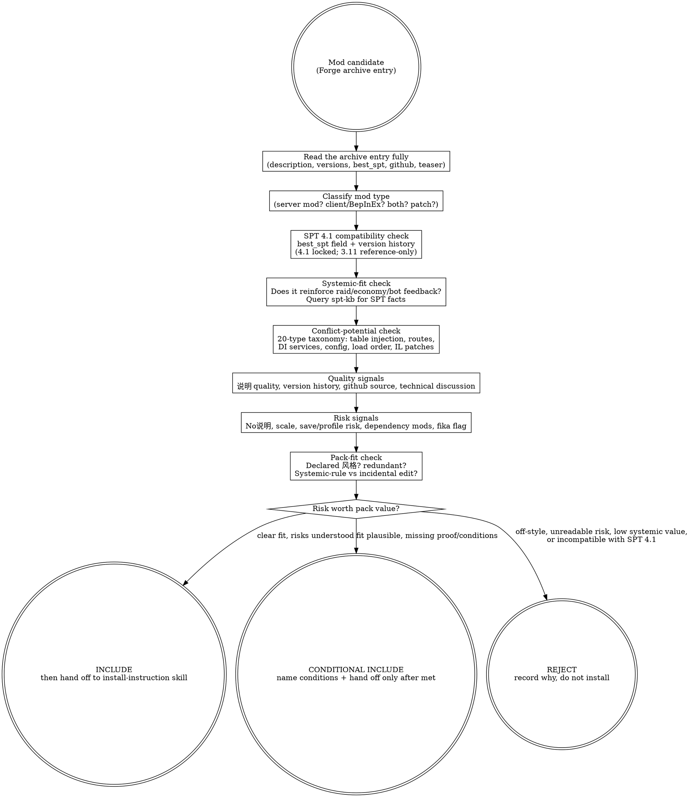

# Evaluating SPT Mods (judgment skill)

SPT is a systems simulator, not a stage play: the pack is trying to build a
Tarkov-like world where behavior leaves traces, state feeds back (raid
economy, bot difficulty, trader restocks, loot tables), and stories happen
because systems collide. A mod is not admitted because it looks impressive in
isolation; it is admitted when it reinforces the pack's declared 风格 AND the
SPT ecosystem's constraints: SPT 4.1 compatibility, server/client mod type,
conflict surface, and quality signals from the offline Forge archive.
Stability is the floor. 风格 is the soul.

## The Iron Law

```text
+-----------------------------------------------------------------------------------------------+
| A mod earns a place in the pack only by fitting the pack's declared 风格 AND reinforcing the    |
| SPT ecosystem's systemic feedback -- popularity and download counts are inputs, never fit.      |
| Compatibility (SPT 4.1), mod type (server/client), and conflict surface are hard filters.      |
+-----------------------------------------------------------------------------------------------+
```

## Route gate (one primary skill per intent)

Use this skill when the decision is **whether the mod belongs** in the pack at all: quality, fit, risk, redundancy, and pack-value before install.

Do **not** use this skill as the primary skill for adjacent intents:

| User intent | Primary skill |
|---|---|
| "How do I install this?" / read the author's instructions / choose DLLs or config files | `interpreting-spt-mod-instructions` |
| "Why is this mod not working" / "which mods conflict" / override reasoning | `spt-conflict-audit` |
| Plan the whole pack, batch strategy, rollback points, naming | `curating-spt-modpack` |

Terminal handoff: after an **INCLUDE** or **CONDITIONAL INCLUDE** verdict, stop judging and hand the mod archive entry to `interpreting-spt-mod-instructions`. Inclusion says "worth considering"; it does not mean "install however you feel like it."

## When to use / When NOT

Use when:

- The user asks "should I add this mod", "is this mod worth it", "这个mod值得装吗", or "does this fit my pack".
- A mod looks too good to be true and needs a judgment pass before install.
- Comparing multiple mods that claim to solve the same pack problem.
- Deciding whether a mod's changes are systemic rules (loot economy, bot AI, trader logic) or incidental 作者个人想法 fighting the pack.
- The pack already has a declared 风格 and the question is fit against that axis.

Do not use when:

- The user is already committed to install and needs author-instruction interpretation.
- The question is conflict semantics between two mods (route registration order, table overwrite order, DI service collisions).
- The pack 风格 has not been declared; first declare it via `curating-spt-modpack` to name the axis being judged.
- You are tempted to replace judgment with a generic popularity/recency checklist. This framework is anti-checklist: situational thought over rules.

## Data source: the offline Forge archive

Forge is offline. ALL mod data comes from the local archive at
`knowledge/spt-kb/archive/forge/`. Do not attempt to call live Forge APIs.

| Archive path | What it gives you |
|---|---|
| `archive/forge/api/mods-catalog.json` | Full 1822-mod catalog (id/name/slug/downloads) |
| `archive/forge/hot-index.json` | 95 hot mods: `id`, `name`, `guid`, `downloads`, `fika`, `github`, `version_count`, `best_version`, `best_spt`, `best_size` |
| `archive/forge/api/hot-mods/<id>.json` | Mod detail: description (author 说明), teaser, links |
| `archive/forge/api/hot-mods/<id>.versions.json` | Full version history with per-version notes |
| `archive/forge/mods/<id>_release/<version>.zip` | Best-version release zip (inspect for DLLs, config files, README) |
| `archive/forge/mods/<id>_source/` | GitHub source clones (18 mods) — author README, code quality, dependencies |

A mod missing from the archive is un-evaluable from Forge metadata; surface it
as `[GAP]` rather than guessing. A mod whose `best_spt` does not include 4.1
(and no documented 4.1-compatible path) fails the compatibility filter unless
the user explicitly accepts a 4.0-version pin.

## Process Flow



## KB query discipline

This skill teaches the judgment posture. It does **not** inline SPT-specific
operational facts (table names, DI semantics, config-loader rules, conflict
signatures). For every evaluation, query the spt-kb and the conflict taxonomy
for current facts before turning risk into a verdict.

Use at least these retrieval shapes:

```text
read knowledge/spt-kb/index.json
-> filter version: ["4.1"], domain: ["server"|"client"|"both"], topic: [...]
-> open relevant curated/api-notes-4.1/* and curated/recipes/* docs

read docs/wayfinder/findings/001-spt-conflict-taxonomy.md
-> conflict type table: table injection, routes/handlers, config, DI services,
   load order, client IL patches; severity per type
```

[STOP] If you are about to write an SPT-specific fact (a table name, a DI rule,
a route-registration detail) into this file, STOP — it belongs in the spt-kb
curated layer or the conflict taxonomy doc. This skill may say "query for the
conflict rules"; it must not fossilize one SPT version's internals.

## Checklist

1. Read the author's 说明 fully before judging — the description/teaser from
   `api/hot-mods/<id>.json` or the README inside `mods/<id>_release/` /
   `mods/<id>_source/`. If it is not English, translate it; the curator's job
   is to understand it anyway.
2. Prefer the archive copy that preserves the author 说明. A release zip with
   files but missing explanation is missing the evaluation surface.
3. If there is no author 说明 at all, reject by default. You cannot evaluate
   consequences that the author did not describe.
4. Check the SPT compatibility axis first: `best_spt` from the hot-index and
   the version history. SPT 4.1 is the locked target; a mod pinned to 3.11 or
   4.0 without a 4.1 path is incompatible unless the user explicitly accepts
   the older pin. 4.1 ecosystem is still migrating — most hot mods sit in the
   `~4.0` band (see `archive/forge/README.md`).
5. Classify the mod type: server mod (`user/mods/`), client mod
   (`BepInEx/plugins/`), or both. Server and client components have different
   conflict surfaces and different install targets.
6. Ask whether the mod reinforces systemic feedback: raid economy, bot
   behavior, trader logic, loot state, quest state — with consistent
   consequences.
7. Assess conflict potential against the 20-type taxonomy
   (`docs/wayfinder/findings/001-spt-conflict-taxonomy.md`): server table
   injection (last-writer-wins by TypePriority), route registration
   (first-registered-wins), DI service collisions (container build failure =
   startup crash), config-type collisions, client IL patches (mostly
   undetectable without IL analysis). Four hard-conflict categories crash at
   startup.
8. Judge the mod against the declared 风格, not against screenshot appeal,
   novelty, or download gravity.
9. Treat most data overlap as normal until there is evidence it causes a real
   problem; do not confuse overlap with failure.
10. On overlap, prefer the mod imposing a systemic unified rule over an
    incidental single-table tweak that looks like 作者个人想法.
11. Account for scale: too many mechanics-changing mods can drown the pack's
    own style even if each mod is individually good.
12. Check dependency requirements: does the mod require Fika, SVM, or another
    mod? A `fika: true` flag in the hot-index means the mod interacts with the
    Fika co-op layer. Missing dependencies are a hard install blocker.
13. Name the mod's role in the pack. If future-you cannot tell why it exists,
    the pack will forget its own architecture.

## Red Flags (STOP)

| Thought | Reality |
|---|---|
| "No description, but lots of downloads, fine." | No 说明 means you cannot evaluate risk. Default reject. |
| "It worked on 3.11, so it will work on 4.1." | 4.0→4.1 rewrote the server in C#; 3.11 TypeScript mods are NOT portable. Check best_spt and the migration docs. |
| "It was recommended in an old list, so it is trusted." | The ecosystem changed; yesterday's essential can be today's broken assumption. |
| "The rehost zip is enough; the files are the same." | Same files without author 说明 lose the risk-evaluation surface. |
| "The log blames mod X, so remove X." | Auto-attribution is heuristic, not diagnosis. Do not yank by ritual. |
| "Stable install means good pack." | Stability is the floor; declared 风格 is the goal. |
| "It loads, so it is compatible." | Loading is not compatibility. A mod can load and silently overwrite another mod's table entries by TypePriority. |

## Rationalizations

| Excuse | Reality |
|---|---|
| "The 说明 is long English; skimming is enough." | Read it fully, even through machine translation. No read, no verdict. |
| "Install first; if it breaks, disable it." | Some mods do not cleanly disable. Uninstall is not rollback. |
| "Conflict detection is hard, so skip it." | The taxonomy exists precisely to name the conflict surface. Prioritize judgment before creating repair debt. |
| "Patience is for beginners; I can go fast." | Patience avoids most avoidable failures. Speed without reading is not expertise. |
| "We can define style later; first make it stable." | Without declared 风格, you have no axis to decide fit. |
| "If it boots, the integration is correct." | Correctness is systemic: behavior must propagate coherently, not merely load. |
| "A few more small tweak mods are harmless." | Each extra server mod adds table-overwrite and route-registration surface. Scale is systemic risk. |

## Recommended Approach: Senior Curator's Lens

> This section reflects an experienced curator's perspective, adapted from the
> BGS lineage's SPT modpack curation work. It is RECOMMENDED guidance,
> **not enforced rule**. If the user has explicit alternative intent (e.g. "I
> want a hardcore realism build" or "I'm doing pure visual showcase"), the
> agent SHOULD adapt rather than push these defaults. The objective rules in
> this skill body still apply.

When the user does not have a strong overriding style preference, the recommended
evaluation lens applies these subjective biases:

1. **System-respecting over content-replacing.** Mods that participate in the
   SPT server mod pipeline (tables, routes, DI, config) with documented
   behavior earn priority over mods that bolt on scripted events that fight
   the load pipeline.
2. **4.1-native over ported legacy.** A mod with a real 4.1-compatible version
   (or a clean 4.0→4.1 migration path) beats one that only ever shipped for
   3.11 TypeScript.
3. **Honest description = real green flag.** Author describing features +
   caveats + known incompatibilities + version-specific notes earns trust
   regardless of surface polish. Hype language ("plug and play", "完美兼容")
   earns suspicion regardless of download count.
4. **Author maintenance pattern over single-mod metrics.** A responsive author
   with a clear changelog (visible in `<id>.versions.json`) earns trust across
   all their mods.
5. **Dependency hygiene.** Mods that declare dependencies and compatible
   versions explicitly beat mods that silently assume them.

## See also

- `interpreting-spt-mod-instructions` — terminal handoff after an INCLUDE/CONDITIONAL INCLUDE verdict; this skill decides fit, that skill reads how to install.
- `spt-conflict-audit` — conflict analysis using the 20-type taxonomy when two mods overlap.
- `curating-spt-modpack` — defines the pack 风格 this skill judges against.
- `knowledge/spt-kb/index.json` + `knowledge/spt-kb/archive/forge/README.md` — retrieval entry points for SPT facts and mod data.
- `docs/wayfinder/findings/001-spt-conflict-taxonomy.md` — the conflict surface used in the conflict-potential check.
