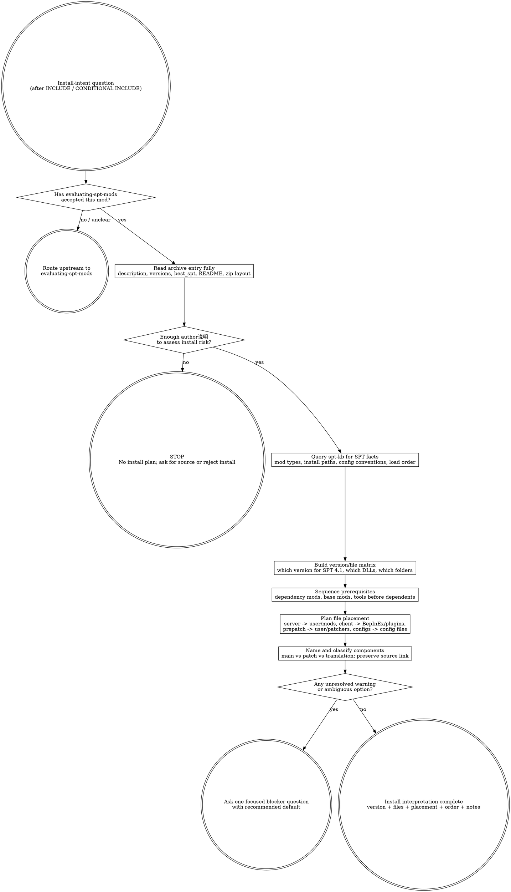

# Interpreting SPT Mod Author Instructions (judgment skill)

This skill answers one question only: **How do I correctly download/install per the mod author's instructions?** It starts after `evaluating-spt-mods` has said INCLUDE or CONDITIONAL INCLUDE. The job is not to decide whether the mod is good; the job is to read the author's说明 until the install path, file choice (which DLLs), config-file placement, prerequisite order, and consequences are actually understood.

SPT mods do NOT have FOMOD installers. There is no installer-option tree to click through. Instead, the install decisions are: which release/version to use, which DLLs go where, whether there is a server component (`user/mods/`), a client component (`BepInEx/plugins/`), a prepatch component (`user/patchers/`), and where config files live.

## The Iron Law

```text
+-----------------------------------------------------------------------------------------------+
| No author说明, no install plan: understand the author's requirements, variants, and consequences |
| before touching downloads, DLL placement, config files, or MO2 overlay state.                  |
+-----------------------------------------------------------------------------------------------+
```

## Route gate (one primary skill per intent)

Use this skill when the user is asking **how to install a mod that is already worth considering**: which file/variant to use, which DLLs to place, where config files go, what prerequisites/dependency mods must be present first, or what the author means by a warning.

Do **not** use this skill as the primary skill for adjacent intents:

| User intent | Primary skill |
|---|---|
| "Should I add this mod?" / quality, risk, fit, pack-value before install | `evaluating-spt-mods` |
| "Why is this mod not working" / "which mods conflict" | `spt-conflict-audit` |
| Write a new SPT mod from templates | `writing-spt-mod` |
| Build/assemble the whole modpack | `building-spt-modpack` |

Upstream gate: `evaluating-spt-mods`. Inclusion says "worth considering"; it does not grant permission to install by habit.

Terminal handoff target: **NONE**. This skill ends with an install interpretation: selected release/version, selected DLLs and their target folders, config-file placement, prerequisite order, naming/tracking notes, and open gaps. If follow-on work requires conflict analysis or pack assembly, route to the appropriate skill.

## When to use / When NOT

Use when:

- The user asks "how do I install this", "which file do I download", "which version/variant", "author说明", "按作者说明安装", "which DLL", "where does the config go", or "what do these install instructions mean".
- A mod has multiple versions in the archive (`<id>.versions.json`) with different SPT compatibility bands.
- A mod ships both server and client components that must land in different folders.
- The author lists prerequisites, dependency mods, warnings, uninstall notes, or compatibility notes that must be converted into an install plan.
- A mod folder in the archive has vague naming and needs traceable local naming before it becomes future debugging debt.

Do not use when:

- The real question is whether the mod belongs in the pack at all. Use `evaluating-spt-mods` first.
- The user is asking to actually perform the installation through MO2 tooling. Use the MO2/control-plane surface after this interpretation, not this skill as a mutator.
- The question is conflict semantics between two installed mods.
- The question is an SPT-specific engine fact. Query the spt-kb instead of fossilizing it here.
- You are tempted to substitute a generic "install normally" checklist for the author's actual instructions.

## Data source: the offline Forge archive

All install instructions come from the local archive at
`knowledge/spt-kb/archive/forge/`. A mod's author 说明 lives in:

| Archive path | What it gives you |
|---|---|
| `api/hot-mods/<id>.json` | Description + teaser (author 说明) |
| `api/hot-mods/<id>.versions.json` | Per-version notes: which version targets which SPT band, changelog warnings |
| `mods/<id>_release/<version>.zip` | The actual files: DLLs, configs, README, folder layout |
| `mods/<id>_source/` | GitHub source clone with full README and dependency declarations |

If the release zip is present, list its contents to see the intended folder
layout (`user/mods/...`, `BepInEx/plugins/...`, `SPT_Data/...`, etc.) and read
any README inside. Cross-check the zip's layout against the author's
description and the version notes.

## Process Flow



## KB query discipline

This skill carries the SPT install-interpretation framework. It does **not**
inline SPT-specific facts about mod layout, config conventions, or load-order
rules. Query the spt-kb for current facts before turning an instruction into an
install decision.

Use at least these retrieval shapes when relevant:

```text
read knowledge/spt-kb/index.json
-> filter version: ["4.1"], topic: ["installation"|"mod-loading"|"config"|"recipe"]
-> open e.g. wiki/Mod_Types.md, wiki/Installing_Mods.md, wiki/Uninstalling_Mods.md,
   curated/api-notes-4.1/mod-loading.md, curated/api-notes-4.1/config-system.md
```

[STOP] If you are about to write an SPT-specific install rule (where server
mods go, how config files are loaded, TypePriority semantics) into this file,
STOP — it belongs in a spt-kb record. This skill may say "query for the mod
types and config conventions"; it must not fossilize one SPT version's layout.

## Checklist

1. Confirm the upstream gate: the mod has already passed `evaluating-spt-mods` as INCLUDE or CONDITIONAL INCLUDE. If not, route upstream.
2. Read the original author 说明 first: `api/hot-mods/<id>.json` description + the README from the release zip or source clone. Rehosted files without 说明 are not enough.
3. Read the author 说明 fully, including requirements, version notes, compatibility notes, changelog warnings, uninstall notes, and dependency declarations.
4. If the 说明 is in another language, translate it. Skipping because it is long or not in your language is not acceptable.
5. If no author 说明 exists, stop by default. Ask for the original source or decline to form an install plan.
6. Query the spt-kb for SPT-specific facts before applying a version, folder, config, or dependency assumption.
7. Build a version/file matrix from `<id>.versions.json`: which version targets SPT 4.1 (locked target), which versions are 3.11/4.0-only. Pick the 4.1-compatible version; flag if none exists.
8. Inspect the release zip layout: identify the server component (`user/mods/<ModFolder>/` with `package.json` + DLLs), client component (`BepInEx/plugins/<ModFolder>/` DLLs), prepatch (`user/patchers/`), and any config files.
9. Choose the variant from author meaning plus current pack state, not from filename vibes or download counts.
10. Sequence prerequisites before dependents: required dependency mods first (e.g. Fika, SVM, or a base mod), then the mod, then optional patches/translations as instructed.
11. Plan config-file placement: server mods configure via files in their `user/mods/<ModFolder>/` folder (config.json / config.jsonc / config.js) with server closed; client mods configure via the in-game F12 menu and/or `BepInEx/config/`. Match the author's stated method.
12. Rename and classify installed components so ownership is obvious: main file, patch, translation, or dependency.
13. Preserve a path back to the archive entry (mod id) so future debugging can re-read the instructions.
14. If one ambiguity remains, ask one focused blocker question with a recommended default; do not invent an install path.

## Red Flags (STOP)

| Thought | Reality |
|---|---|
| "No description probably means normal install." | No说明 means risk cannot be assessed. Stop or find the original source. |
| "The zip has the files, so the description doesn't matter." | The description carries requirements and consequences; files alone lose that. |
| "The latest version is always the right one." | The latest version may target a different SPT band. Match `best_spt` / version notes to SPT 4.1. |
| "I can choose the DLL from the filename." | Filenames are clues, not instructions. Confirm the author's stated target folders. |
| "The mod manager will sort it out." | MO2 executes overlay operations; it does not understand author intent or DLL placement. |
| "Server and client parts can both go in `user/mods`." | Server mods go in `user/mods`; client BepInEx plugins go in `BepInEx/plugins`. Mixing them breaks loading. |
| "Disable is rollback." | Some mods, especially profile-touching server mods, do not cleanly leave an active save. |
| "This is install work, so the spt-kb is unnecessary." | SPT layout/config facts live in the spt-kb; the skill is deliberately version-agnostic. |

## Rationalizations

| Excuse | Reality |
|---|---|
| "I already decided the mod is good, so install is routine." | Inclusion answers worth; install still has version, DLL-placement, config, and prerequisite decisions. |
| "I'll copy every DLL into every folder and sort it later." | Server and client DLLs land in different trees; misplacement breaks loading. Read the layout first. |
| "I'll install first and read if something breaks." | Reading is the install step that prevents preventable breakage. |
| "I remember what this patch is for." | Future-you forgets. Name and classify now. |
| "The author says use a dependency; I'll improvise." | A missing dependency mod is a hard install blocker. Sequence prerequisites before dependents. |
| "The comments say another version works better." | Comments are clues; author instructions and the version matrix carry the plan. |
| "Config can be changed later at any time." | Server mods require the server closed to reconfigure; some changes need a fresh raid or profile reset. |

## Recommended Approach: Senior Curator's Lens

> This section reflects an experienced curator's perspective, adapted from the
> BGS lineage's SPT modpack curation work. It is RECOMMENDED guidance,
> **not enforced rule**. If the user has explicit alternative intent (different
> install policy, different risk tolerance, or pack-specific convention), the
> agent SHOULD adapt rather than push these defaults. The objective rules in
> this skill body still apply.

Recommended author-instruction lens:

1. **Honest detailed instructions = green flag.** Author who lists
   prerequisites, SPT version compatibility, DLL placement, config-file
   meaning, and known issues earns trust. Curt or evasive instructions earn
   skepticism.
2. **Version-pinned install notes are gold.** An author who states exactly
   which version works on SPT 4.1 saves the curator from the 3.11/4.0/4.1
   migration trap. Treat an unversioned "just works" claim as incomplete.
3. **Dependency transparency = trust.** A mod that declares "requires SVM" or
   "conflicts with X" is easier to place in a pack than one that silently
   assumes a clean ecosystem.

## Investigating mods absent from the archive (pulled / deleted from Forge)

When a mod the user wants is not in the archive (or the archive README's
"无法获取" 404 list names it), do NOT default to "give up". The priority
investigation order:

1. **Archive catalog check** — search `api/mods-catalog.json` for the mod name
   or slug; the mod may exist under a different id.
2. **Source clone check** — is there a `mods/<id>_source/` clone even if the
   release zip is missing? The source clone may still contain install
   instructions and buildable code.
3. **Version history check** — `api/hot-mods/<id>.versions.json` may survive
   even when the download is gone; use it to identify the correct version and
   its SPT band.
4. **Alternative implementation** — a different mod (or a maintained fork in
   the archive) may cover the same function.
5. **Record the investigation** in `<project>/docs/dev-log.md` so
   half-a-year-later "why did we skip X?" is answerable.

## See also

- `evaluating-spt-mods` — upstream judgment: decides whether the mod belongs in the pack before this skill interprets installation.
- `spt-conflict-audit` — conflict analysis when installed mods overlap (20-type taxonomy).
- `building-spt-modpack` — whole-pack assembly after per-mod install plans exist.
- `knowledge/spt-kb/` — required source for SPT layout facts, mod types, config conventions, and install hazards (via `index.json`).
- `knowledge/spt-kb/archive/forge/` — the offline mod archive that supplies all author instructions.
