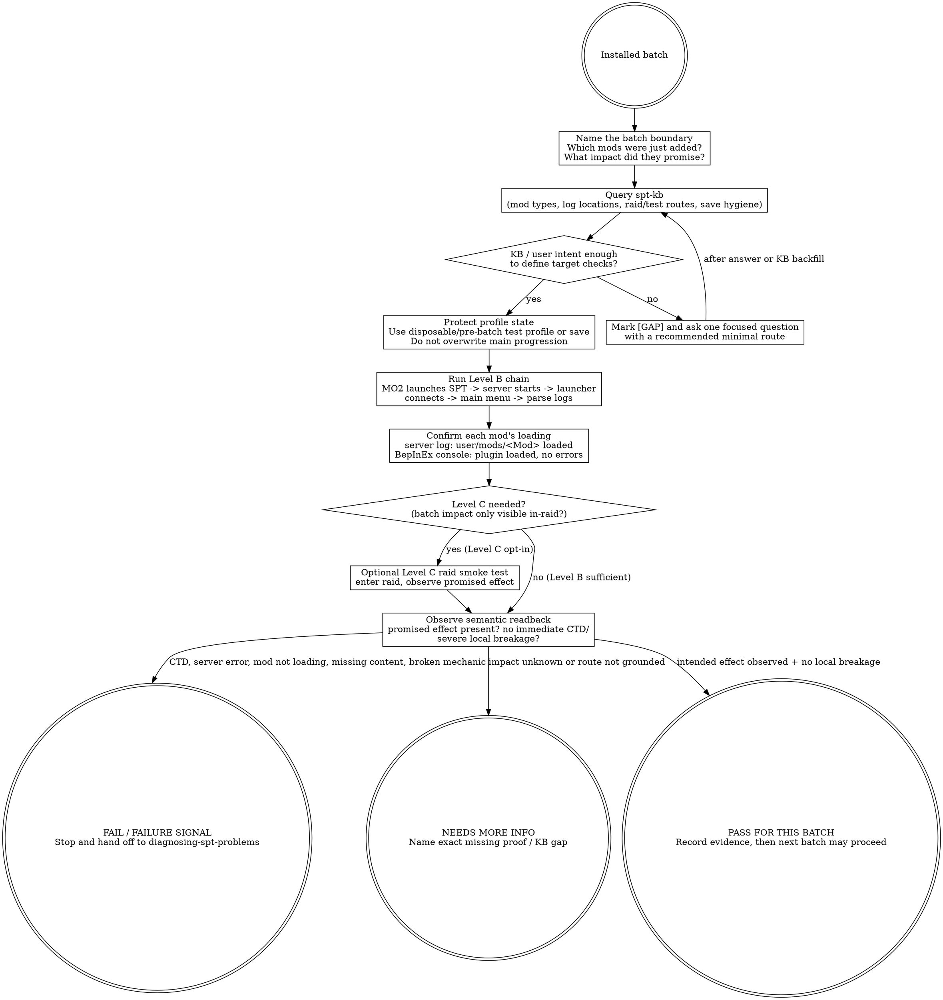

# Testing SPT Modpack Batches (judgment skill)

This skill answers one question: **"It's installed -- how do I PROACTIVELY verify this batch before declaring the batch good?"**

SPT is a client/server pair, so verification is a chain, not a single launch:
MO2 must launch SPT, the server must start and stay up, the launcher must
connect, the game must reach the main menu, and each mod's loading must be
confirmed from the server log and the BepInEx console output. This is the
**Level B standard** (wayfinder ticket #4). A **Level C raid smoke test** —
entering a raid and observing the batch's intended in-game effect — is the
optional manual deep verification.

Do not manufacture a giant universal QA checklist. Test the batch's intended
in-game impact, preserve save/profile hygiene, query the spt-kb for SPT-specific
commands/routes, and mark `[GAP — needs user input]` when the substrate is
silent.

## The Iron Law

```text
+------------------------------------------------------------------------------------------------+
| A batch is not accepted because the server booted or the main menu loaded. It is accepted only  |
| after Level B evidence: MO2 launches SPT, server starts, launcher connects, main menu reached,  |
| and EVERY mod's loading is confirmed from server log + BepInEx console output — with no          |
| immediate local breakage and no unverified state baked into the user's main profile.            |
+------------------------------------------------------------------------------------------------+
```

## Verification levels (wayfinder #4)

| Level | What it proves | How |
|---|---|---|
| **Level B (required)** | The installed batch is loadable end-to-end | MO2 launches SPT; `SPT.Server.exe` starts and stays up; launcher connects; game reaches main menu; each mod's loading confirmed via server log (`user/logs/`) + BepInEx console output parsing |
| **Level C (optional, manual)** | The batch's intended in-game effect works | Raid smoke test: enter a raid, observe the batch's promised behavior (trader, loot, bot, quest, item), no immediate CTD/severe breakage |

Level B is the acceptance gate. Level C is the deep-verification pass the user
may opt into for batches whose impact is only observable in-raid.

## Route gate (one primary skill per intent)

Use this skill when the user has already installed a batch and wants a **proactive post-install verification pass**: what to inspect, what to parse, what counts as enough evidence to move to the next batch.

Do **not** use this skill as the primary skill for adjacent intents:

| User intent | Primary skill |
|---|---|
| "It crashed", "server won't start", "mod not loading", "raid-start crash", or any failure already observed | `diagnosing-spt-problems` |
| "Should this mod go in the pack?" before install | `evaluating-spt-mods` |
| Define pack style, batch size, rollback boundaries, naming/separator discipline | `curating-spt-modpack` |
| Which mods conflict / why is this mod not working | `spt-conflict-audit` |

Terminal handoff: if proactive testing finds a failure signal, stop calling it "testing" and hand off to `diagnosing-spt-problems`. A failed verification pass is not an invitation to improvise a fix inside this skill.

## When to use / When NOT

Use when:

- A small batch was installed and the user asks "what should I test before moving on?"
- The user asks "is it stable?", "post-install check", "验证安装", or "测试整合包".
- You need Level B confirmation that the batch loads cleanly end-to-end before committing playthrough state.
- You need to confirm each mod's load status from logs (server + BepInEx console).
- You need a save/profile-hygiene reminder before the user commits playthrough state.

Do not use when:

- A crash/server-start/mod-load failure already exists. Escalate to `diagnosing-spt-problems`.
- The question is whether to include the mod at all. Use `evaluating-spt-mods`.
- The batch boundary is unknown and the user wants to plan the pack architecture. Use `curating-spt-modpack`.
- You are about to write SPT-specific console commands or log-parsing catalogs into this file. Those belong in the spt-kb.
- You are tempted to invent generic QA filler like "verify all systems work". Mark `[GAP — needs user input]` instead.

## Process Flow



## Level B execution detail

1. **MO2 launches SPT.** Start SPT through MO2 (the MO2 profile defines the VFS
   overlay of the batch's mods). Confirm the launch actually ran through MO2's
   VFS, not a bare shortcut.
2. **Server starts.** `SPT_Runtime\SPT.Server.exe` comes up and stays up
   (watch `user/logs/` for the server-ready signal). A startup refusal is a
   hard failure — hand off to `diagnosing-spt-problems`.
3. **Launcher connects.** `SPT.Launcher.exe` reaches the running server and the
   profile list loads. Connection failure here points at server/launcher or
   port config, not mod content.
4. **Game reaches main menu.** The BepInEx-patched client loads to the main
   menu without crashing. A client-side failure here surfaces in
   `BepInEx/LogOutput.log` and the BepInEx console.
5. **Each mod's loading confirmed.** Parse the server log
   (`user/logs/`) for each `user/mods/<Mod>` load line and the BepInEx console
   output for each `BepInEx/plugins/` plugin load. A mod that should be in the
   batch but never logs a load line is a failure signal — it may have failed
   validation or been placed in the wrong tree.

## KB query discipline

This skill teaches the testing posture. It does **not** inline SPT-specific
commands, log signatures, or test routes.

Before recommending a test route or log check, query the spt-kb for the current
SPT version and the batch's mod-impact type:

```text
read knowledge/spt-kb/index.json
-> filter version: ["4.1"], domain: ["server"|"client"|"both"],
   topic: ["troubleshooting"|"installation"|"mod-loading"]
-> open e.g. wiki/Installing_Mods.md, wiki/Uninstalling_Mods.md,
   curated/api-notes-4.1/mod-loading.md, wiki/5050-method.md
```

[STOP] If the spt-kb is silent on a command or route, do not invent one from
memory. Mark `[GAP — needs user input]` and ask for the user's preferred test
route or save boundary, or recommend the smallest non-saving visual/mechanic
check that follows from the mod author's stated impact.

## Checklist

1. Name the batch: list only the mods just installed and the intended impact of each. If the batch boundary is unclear, mark `[GAP — needs user input]` and ask for it.
2. Read / reuse the author-stated impact: what should visibly or mechanically change if the install is correct?
3. Query the spt-kb for the current SPT version's log locations, test routes, and mod-loading facts.
4. If the spt-kb lacks routes or commands, mark `[GAP — needs user input]`; do not write a universal route from memory.
5. Protect profile state before testing. Use a disposable/pre-batch test profile or another user-approved save boundary. `[GAP — needs user input]`: exact safe-save procedure is profile-specific.
6. Do **not** save over the user's main progression until the batch has a PASS verdict.
7. Run the Level B chain in order: MO2 launch -> server start -> launcher connect -> main menu -> log parsing. Record where the chain breaks if it does.
8. Confirm every batch mod's load line: server log for `user/mods/` mods, BepInEx console for `BepInEx/plugins/` plugins. Silent absence is a failure signal.
9. If the batch's impact is only observable in-raid, offer the optional Level C raid smoke test. Do not demand Level C for every batch; do not skip it silently when the impact is in-raid-only.
10. Look for positive evidence: the promised mod behavior present once, expected server route responses, no immediate CTD or severe local breakage.
11. Treat error overlays / missing assets / broken UI / severe local FPS collapse as failure signals. `[GAP — needs user input]`: exact overlay strings and visual markers are per-mod facts for the spt-kb.
12. Do not expand into a whole-pack investigation. If the batch fails, route to `diagnosing-spt-problems`; if it passes, record "PASS for this batch" and move to the next batch.
13. Record the evidence in plain terms: batch name, SPT version, profile, save boundary, Level B results per mod, any Level C observations, failure signals absent/present, remaining `[GAP]` items.

## Red Flags (STOP)

| Thought | Reality |
|---|---|
| "The server started, so the batch is stable." | Server start is one rung of Level B. Each mod's load must still be confirmed in the logs. |
| "The main menu loaded, so we're done." | Main menu is rung 4 of 5. Unconfirmed mod loads mean the batch is not verified. |
| "MO2 says enabled; no need to check logs." | Manager enablement is not semantic readback. A mod can fail validation or land in the wrong tree silently. |
| "I'll save normally first so the mod initializes." | Do not bake unverified batch state into the main progression profile. Use a save boundary. |
| "No crash for five minutes means accepted." | No CTD is one support signal. Acceptance also needs each mod's load line and the intended effect. |
| "Something broke; keep using this checklist until fixed." | A failure signal exits this skill. Hand off to `diagnosing-spt-problems`. |
| "Log parsing is obvious across SPT versions." | Log locations and load lines are version-specific. Query the spt-kb first; mark `[GAP]` if absent. |

## Rationalizations

| Excuse | Reality |
|---|---|
| "Testing the whole pack every time is safer." | Proactive verification is batch-bounded. Whole-pack diagnosis begins after a failure signal. |
| "I can test after a few more batches; this one is small." | Delayed testing destroys the recent-batch boundary that makes failures attributable. |
| "The mod is config-only; no need for a save boundary." | Maybe, but the skill cannot know that without the author's stated impact and spt-kb facts. Mark uncertainty instead of guessing. |
| "If the expected content is absent, maybe it appears later." | Maybe. It is still not verified. Mark NEEDS MORE INFO or hand off to diagnosis. |
| "A generic boot check is good enough." | Level B is the required chain. A boot check covers maybe two of its five rungs. |
| "The user wants confidence, not gaps." | False confidence is worse than a marked gap. Honest `[GAP]` is the correct deliverable when the spt-kb is silent. |

## Recommended Approach: Senior Curator's Lens

> This section reflects an experienced curator's perspective, adapted from the
> BGS lineage's SPT modpack curation work. It is RECOMMENDED guidance,
> **not enforced rule**. If the user has a working testing process they prefer,
> the agent SHOULD respect that.

Recommended testing rhythm:

1. **Stage-test after each batch, not after each mod.** Batch together additive
   low-risk mods, then run one Level B pass. Single-mod testing has infinite
   time cost.
2. **Parse logs, don't skim them.** The server log's mod-load lines and the
   BepInEx console's plugin-load lines are the objective Level B evidence.
   Grep for each batch mod by name.
3. **Commit save before risky batches.** Profiles are the rollback substrate.
4. **Long-session discovery is part of the testing rhythm.** Many defects only
   emerge after extended play (economy drift, bot behavior, quest state).
   Don't claim "stable" from a single Level B pass.
5. **Level C is opt-in but honest.** If the batch's impact is only visible in a
   raid (trader assort, loot tables, bot behavior), say so and offer the raid
   smoke test rather than claiming in-raid correctness from a main-menu pass.

## See also

- `diagnosing-spt-problems` — use after any crash, server-start failure, mod not loading, log error, or failed verification signal.
- `curating-spt-modpack` — owns batch boundaries, rollback rhythm, pack style, and naming/separator discipline.
- `evaluating-spt-mods` — decides whether a mod should be included before install.
- `interpreting-spt-mod-instructions` — reads author instructions and file placement before the testable batch exists.
- `spt-conflict-audit` — conflict analysis when a failed verification points at mod interaction.
- `knowledge/spt-kb/index.json` — required source for log locations, mod-loading facts, and SPT-version-specific verification facts.
- `docs/wayfinder/tickets/004-define-modpack-build-pipeline.md` — the source of the Level B / Level C verification standard.
